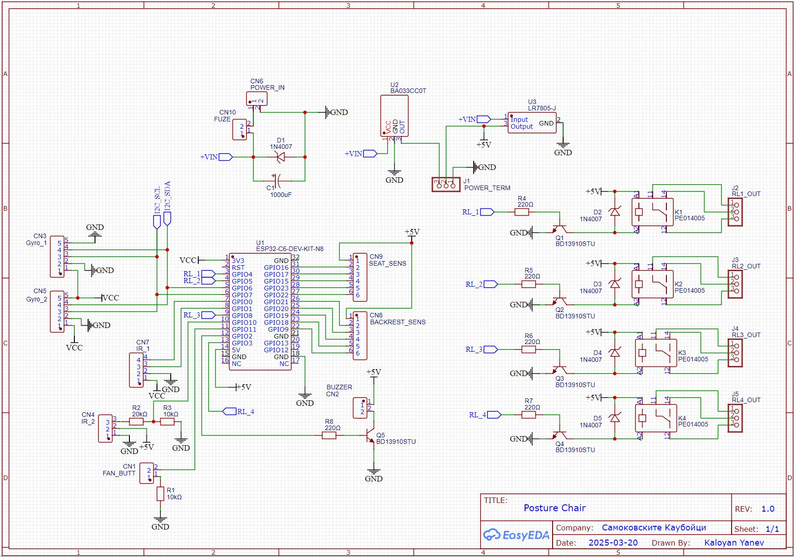
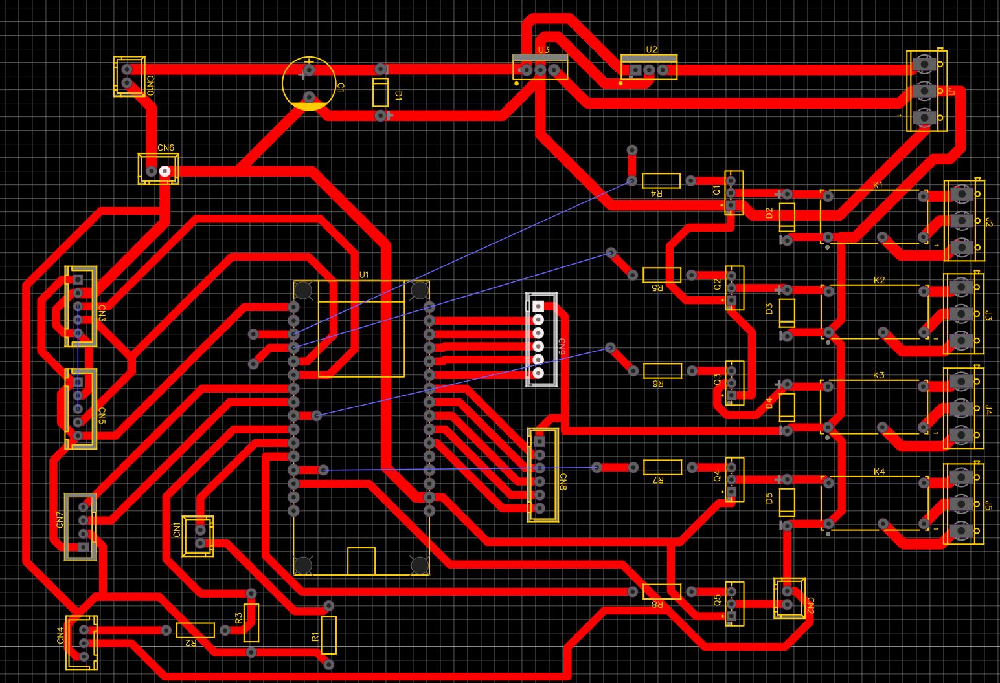
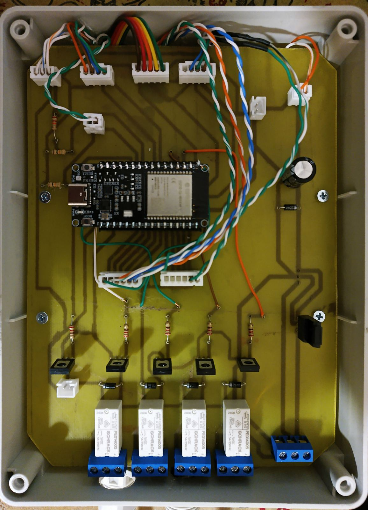

# Spine Buddy
## Проект за HackTues 11
Spine Buddy е устройство, което може да бъде поставено на всеки стол и което мотивира хората да седят правилно, чрез наблюдение и коментиране на тяхната поза на седене, като също ги кара да се раздвижват след като са седяли твърде много време, така че да се предотвратят гръбначни изкривявания и да се поддържа общото здравословно състояние на човека. Данните и настройките за тези функции се показват и контролират от нашият уеб сайт.
## Използвани технологии
- **Flask framework**: Свързва страниците на сайта и позволява да ползваме template за повтарящи се елементи.
- **ESP32**: Основен процесор за данните от сензорите и връзка със сайта.
- **MySQL**: Трансформиране и връзка на информацията от сензорите с python кода.
- **Bluetooth Low Energy**: Връзка с ESP32 микрокотроллера и сайта.
## Функционалности
- **Уеб нотификации**: Потребителят има опцията да се абонира за уеб нотификации, за да заглуши аудиото на устройството, в случай че не го желае.
- **Звукова обратна връзка**: Устройството е способно да издава аудио, за да напомня на потребителя да стане и да се раздвижи.
- **Настройване на таймерите**: Таймерите за раздвижване и ставане са напълно персонализирани. Има бутон за нулиране на настройките.
- **История на позите**: Има таблица, в която са запазени средноаритметичните пози за всеки час през последните 7 дена и колко % от часа позата е била здравословна.
## Hardware

## Приноси
Всички приноси за Spine Buddy са добре дошли! Позволяваме клонирането на хранилището, правенето на промени и изпращането на pull заявки. За големи промени, моля, отворете issue, за да се обсъдят предложените промени.
## Лиценз
Този проект е лицензиран под [Gnu General Public License](LICENSE).
## Благодарности
Благодарим всичките разработчици и приносители за Flask, Python, MySQL, Arduino IDE за техните технологии и ресурси, използвани в Spine Buddy.
## Нашия отбор
- **Адриан Алексов**: Front end, README.md, Презентацията
- **Калоян Янев**: Embedded, Ецване на платката
- **Борис Стрински**: Back end, датабазата, Bluetooth връзка
- **Виктор Алексиев**: Програмиране на микроконтролера
- **Георги Илиев**: Back end, датабазата, HTML